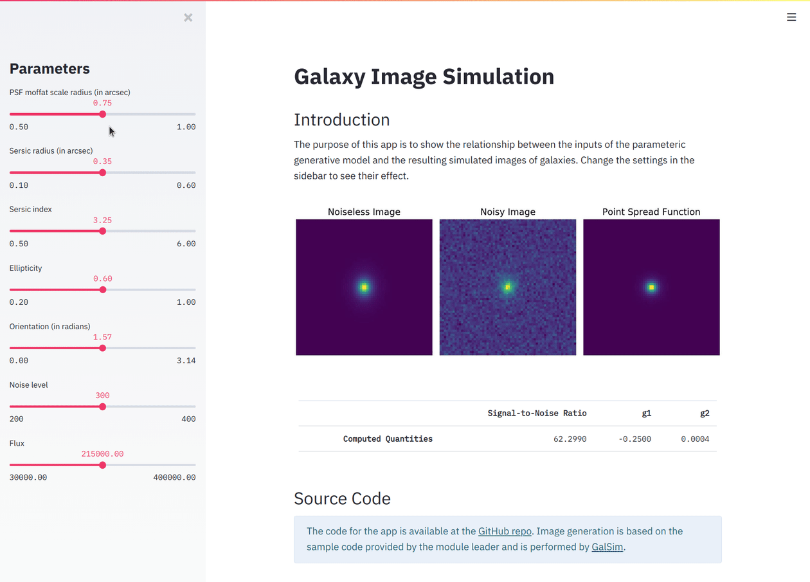

# Estimating Galaxy Shape and Flux
Measuring the shape and brightness of galaxies with neural networks.

Harvard University<br>Class: CS 109B — Advanced Topics in Data Science<br>Project Advisors: [Douglas Finkbeiner](https://scholar.google.com/citations?hl=en&user=boVy0Y0AAAAJ) and Jun Yin<br>Deliverables: [Code Report](https://nbviewer.jupyter.org/github/dvukolov/measure-galaxies/raw/master/Project/final_report.ipynb) and an oral presentation

Table of Contents
-----------------

* [Summary of Research](#summary-of-research)
   * [Problem Statement](#problem-statement)
   * [Data Generation](#data-generation)
   * [Target Variables](#target-variables)
   * [Exploratory Data Analysis](#exploratory-data-analysis)
   * [Model Building](#model-building)
   * [Evaluation](#evaluation)
* [Reproducing the Results](#reproducing-the-results)
* [Key Repository Files](#key-repository-files)

## Summary of Research

### Problem Statement

As astronomers collect more and more image data, there is a need for further development of automated, reliable, and fast analysis methods. Our work is a proof-of-concept study of deep neural network architectures to estimate galaxy parameters from simulated data. By showing that modern data-driven approaches can succeed in this problem, we hope to open the door to future work on real galaxies, including edge cases that traditional model-fitting methods handle poorly.

### Data Generation

We use [GalSim](https://github.com/GalSim-developers/GalSim) to generate the images of galaxies, following these steps:

1. **Sérsic profile:** Define a galaxy's [Sérsic profile](https://en.wikipedia.org/wiki/Sersic_profile) parametrized by the Sérsic index and the radius that encloses half of the total flux
2. **Flux & shear:** Add flux and shear (defined by ellipticity and orientation) to complete the galaxy definition
3. **PSF:** Convolve the galaxy profile with the Point Spread Function, which is determined by the telescope optics and the atmosphere (for ground-based telescopes)
4. **Noise:** Add Poisson noise (i.e. detected photoelectrons) and Gaussian noise (i.e. read noise) to the generated the image
5. **Signal-to-noise ratio:** Compute the signal-to-noise ratio (SNR) based on the pixel values and the noise level (assuming faint galaxies). Preserve only the images with SNR between 10 and 100.
### Target Variables

Our goal is to estimate the following five parameters from image data, which are recorded alongside the generated images:

- Sérsic profile: determined by the **Sérsic index** and the **Sérsic radius**
- Galaxy **flux**
- Reparameterized **ellipticity and orientation**: $g_1$ and $g_2$

### Exploratory Data Analysis

As part of the analysis, we created an interactive [web app](https://measure-galaxies.herokuapp.com/) that laid the foundation for understanding the data. We used it throughout our project to study the relationship between galaxy parameters and the resulting images. It also helped us identify which parameter combinations could present a particular issue for the model versus which would be relatively easier to estimate.



### Model Building

The project team pursued multiple approaches to model building:

#### Autoencoders

An autoencoder has two potential advantages:

- First, an autoencoder is learning from both the labels and the noiseless images and thereby might incorporate more information about the underlying relationships into the network.
- Secondly, an autoencoder can be used not only to predict the labels but also to denoise and reconstruct the images.

#### Neural Architecture Search

Using a small subset of the data we run [AutoKeras](https://autokeras.com/), an AutoML tool, to quickly test vanilla CNNs, ResNets, and Xception networks with different complexities, regularization, and normalization parameters. The search is guided by Bayesian optimization with Gaussian Processes.

#### Grid Search of Hyperparameters
We pick several key hyperparameters of the best Xception CNN model, expand their range, and evaluate the effect using a small portion of the data. This allows us to significantly reduce the model size, decrease the training time, while simultaneously maintaining or even improving predictive performance.

#### Denoising Pipeline

Informed by a large gap between performance metrics for noiseless and noisy data, we test a two-stage pipeline described in [Madireddy (2019)](https://arxiv.org/pdf/1911.03867) that uses a separate denoising network as the first step. We follow a similar approach by implementing two state-of-the-art algorithms for image denoising and restoration:

- EDSR ([Enhanced Deep Residual Networks](https://arxiv.org/pdf/1707.02921))
- RDN ([Residual Dense Networks](https://arxiv.org/pdf/1812.10477))

We train these models on a separate dataset of simulated galaxies, then apply them to our noisy inputs and proceed with an Xception CNN model.

### Evaluation

#### Performance on the Test Set

We perform a series of comparisons between the estimated vs true parameters on the test dataset, analyzing the results in the report:


#### Baseline Model

The conventional baseline approach in our case is to carry out non-linear optimization for five parameters with the noisy galaxy image as the input. We use the `L-BFGS-B` bounded optimization algorithm. The objective function we minimize takes the noisy image, iteratively generates new images using GalSim, and calculates the loss as the negative log-likelihood of the image given the current iteration of parameter values.

#### Benchmark Against the Cramér–Rao Bound

Our neural network models are estimators for five fixed yet unknown parameters. To understand what are the smallest errors we can expect, we compare our results to the lower bound on the variance of an unbiased estimator expressed by the [Cramér–Rao bound](https://en.wikipedia.org/wiki/Cram%C3%A9r%E2%80%93Rao_bound).

## Reproducing the Results

The project is computationally intensive, requiring GPU for running the experiments. The code is built using:

- Tensorflow
- AutoKeras
- HiPlot
- GalSim
- and a standard Python data science stack including NumPy, pandas, scikit-learn, matplotlib, Jupyter Notebook.

Use the provided conda environment specification to satisfy all dependencies:

```
$ conda env create -f environment.yml
$ conda activate galaxies
```

The interactive web app additionally makes use of Streamlit. A corresponding Dockerfile is provided in the app directory.

## Key Repository Files

```
.
├── EDA
│   ├── app                   # Interactive web app
│   └── EDA.ipynb             # Exploratory data analysis
├── Project
│   ├── autoencoder*.ipynb    # Autoencoder building and training
│   ├── baseline.ipynb        # Baseline model and evaluation
│   ├── final_report.ipynb    # Final code report
│   └── presentation.ipynb    # Slides for the oral presentation
├── data
│   ├── datasets.ipynb        # Description of datasets used
│   ├── gen_test.py           # Test dataset generation
│   └── generator.py          # Train and validation set generation
├── experiments
│   ├── autokeras             # AutoML experiments and saved models
│   ├── denoising             # Implementation of denoising pipelines
│   └── gridsearch            # Hyperparameter optimization
├── models
│   ├── xception.ipynb        # Xception CNN architecture
│   └── xception_data*        # Training and saved models
└── environment.yml           # Conda environment
```

